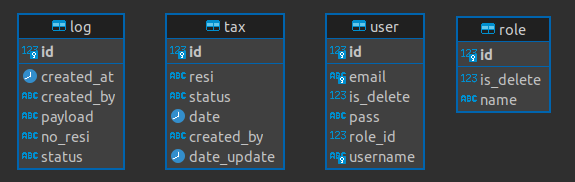

# Test Backend| Tax Application
## Specifications
- Java 11
- MySql
- Maven 3.6 or later
- RabbitMq

## IDE
- Intellij
- Netbeans
- Eclipse
- VsCode

## Run Program
1. Create a database with the name demo_project after that import demo_project.sql to the database that was created
```sh
mysql -u user_name -p demo_project < demo_project.sql
```

3. Change the mysql username and password in the application.yml file for the two applications according to your PC or laptop
3. Run the project user and tax application in current folder with button run or terminal below
```sh
mvn clean spring-boot:run
```

## Run Postman
you can download and import the api collection here https://api.postman.com/collections/5677441-f5cb9f38-4535-4f08-99fd-f183a8fc9799?access_key=PMAT-01GWRA987QPRB6EKWW3ARS7RMF
1. Before transacting data, you must login first to get access token
2. All password user is "pass"
3. If you already have an access token, you can copy and paste it in the headers authorization - bearer token

